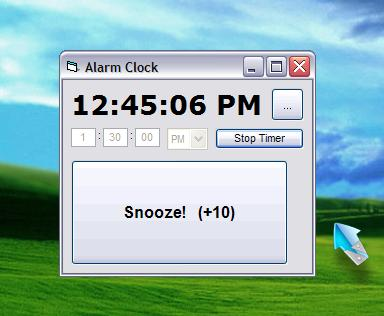

## Alarm Clock,  That plays music\!

### Description

Wakes you up. by playing music of your choice, and not an alarm noise or somthing.
 
### More Info
 
Parents getting mad if you dont wake up, and the music is blaring all morning waking them up.

             |
---                |---
**Submitted On**   |2005-05-29 22:58:18
**By**             |[David A\. Carrigan](https://github.com/Planet-Source-Code/PSCIndex/blob/master/ByAuthor/david-a-carrigan.md)
**Level**          |Beginner
**User Rating**    |3.7 (11 globes from 3 users)
**Compatibility**  |VB 6\.0
**Category**       |[Sound/MP3](https://github.com/Planet-Source-Code/PSCIndex/blob/master/ByCategory/sound-mp3__1-45.md)
**World**          |[Visual Basic](https://github.com/Planet-Source-Code/PSCIndex/blob/master/ByWorld/visual-basic.md)
**Archive File**   |[Alarm\_Cloc1953401232005\.zip](https://github.com/Planet-Source-Code/david-a-carrigan-alarm-clock-that-plays-music__1-63397/archive/master.zip)

### API Declarations

The one to make everything XP style.

